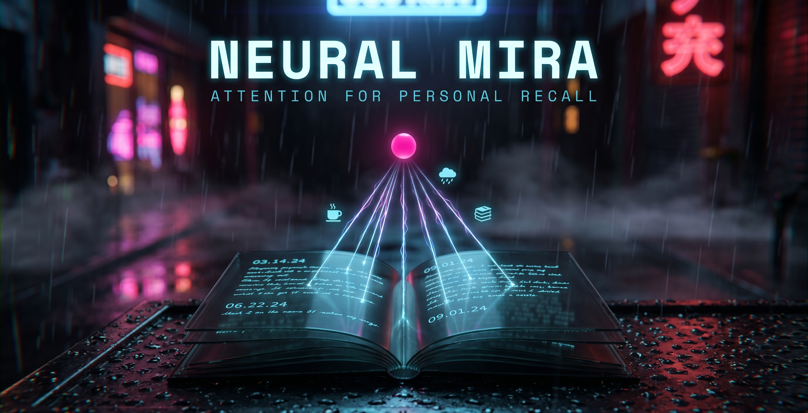

# Neural MIRA

[](https://github.com/DenizYunus/neural-mira/actions/workflows/ci.yml)
[](LICENSE)

> Neural attention head for personal recall. Trains on diary entries to learn temporal, source-trust, and relevance-aware ranking.

+ 

## Why

Generic retrieval-augmented systems treat *"find my notes about X"* the same as *"find a Wikipedia article about X"* — a single vector-similarity sort over a flat document store. That works for facts. It fails for **autobiographical** memory, where the right answer depends on:

- **When** something happened ("last week", "last year", "around the move")
- **Where** the trace lives (a polished diary entry beats a WhatsApp message beats an LLM-summarized day)
- **Who** was involved (people, places, recurring themes)
- **What state** you were in (mood, the surrounding week, what came before)

Neural MIRA is a small attention head trained to fuse those signals — plus dense semantic match — into a single ranking. It rides on top of a transparent feature pipeline (BM25, scalar HTEMA, multilingual MiniLM, source-trust priors, temporal proximity) so you can see *why* a memory surfaced, not just *that* it did.

## Quick start

The fastest way to see Neural MIRA work is on someone else's diary. **Anne Frank's *The Diary of a Young Girl*** is short (~76 entries, June 1942 → August 1944), emotionally rich (mood, fear, hope, growing up, hiding from war), and structurally simple — every entry is dated. Public domain in the EU since 2016 and Australia since 1995.

Five commands from clone to working search:

```bash
git clone https://github.com/DenizYunus/neural-mira.git
cd neural-mira
pip install -r requirements-neural.txt
cp .env.example .env                  # then paste your LLM_API_KEY
python scripts/fetch_demo_data.py     # downloads diary, LLM-tags each entry (~$0.10-0.30)
python scripts/search_htema.py "days she felt hopeful" --limit 5
```

What happens under the hood:

1. Downloads a text-based PDF of the diary (cached locally — runs offline after the first fetch).
2. Extracts 76 dated entries with clean prose.
3. Calls your configured LLM (DeepSeek / OpenAI / any compatible) once per entry to extract:
   - **mood** 1–5 from sentiment
   - **icons** — lowercase tags for people (`kitty`, `peter`, `father`), places (`secret_annex`, `school`), themes (`fear`, `hope`, `war_news`, `growing_up`), and activities (`birthday`, `reading`, `argument_with_mother`)
4. Writes everything to `data/diaries/anne_frank.md` in the format the parser expects.

After that, try queries that exercise different signals:

```bash
python scripts/search_htema.py "her thoughts about Peter in early 1944"
python scripts/search_htema.py "moments of fear during air raids"
python scripts/search_htema.py "small joys inside the secret annex"
python scripts/search_htema.py "arguments with her mother"
```

The first hits the **temporal** head (early 1944), the second the **emotional** + **diary-feature** heads (fear + raids), the third combines **dense semantic** + **source-trust**, the fourth tests **people-entity** matching.

> **Want to use your own diaries instead?** Skip `fetch_demo_data.py` and drop `*.md` files into `data/diaries/` in the format documented at [`data/README.md`](data/README.md). The parser auto-discovers them.

Full walkthrough with sanity-check tips and bring-your-own-diary instructions: [`docs/quickstart.md`](docs/quickstart.md).

## See it actually work

Real, unedited results from `search_htema.py` against the 76-entry Anne Frank demo corpus — **no training**, just the default scalar HTEMA weights. (`Mood` is the LLM-inferred 1–5 score stored per entry; minor OCR artifacts from the source PDF left as-is.)

**`"news about the war and the invasion"`**

| # | Date | Mood | Excerpt |
|---|------|:----:|---------|
| 1 | 1944-06-09 | 5 | "Great news of the invasion! The Allies have taken Bayeux, a village on the coast of France…" |
| 2 | 1944-06-06 | 5 | "'This is D-Day,' the BBC said on the radio at twelve o'clock. 'This is the day. The invasion…'" |
| 3 | 1944-03-29 | 3 | "Mr Bolkestein, from the Government, was speaking on the Dutch broadcast from London…" |

→ Surfaced **both D-Day entries** (6 & 9 June 1944) at the top via semantic + thematic match.

**`"moments of fear during air raids"`**

| # | Date | Mood | Excerpt |
|---|------|:----:|---------|
| 1 | 1943-01-13 | 1 | "Terrible things are happening outside. People are being pulled out of their homes and arrested…" |
| 2 | 1943-08-03 | 2 | "We just had a third air raid. I am trying to be brave. Mrs van Daan…" |
| 3 | 1944-03-29 | 3 | "Mr Bolkestein… on the Dutch broadcast from London…" |

→ The **emotion head** pulled the two lowest-mood (1 and 2) air-raid entries to the top.

**`"her thoughts about Peter in early 1944"`**

| # | Date | Mood | Excerpt |
|---|------|:----:|---------|
| 1 | 1944-01-06 | 3 | "I realized what's wrong with Mother. She says that she sees us as her friends, not her…" |
| 2 | 1944-02-18 | 4 | "Whenever I go upstairs, it's always so that I can see him. I have something to look forward…" |
| 3 | 1944-03-19 | 5 | "Yesterday was a very important day for me. At five o'clock I put on the potatoes to cook…" |

→ The **temporal head** confined results to Jan–Mar 1944; the **person head** kept them on Peter/relationships.

**`"arguments with her mother"`**

| # | Date | Mood | Excerpt |
|---|------|:----:|---------|
| 1 | 1943-04-02 | 2 | "I'm in trouble again! Last night, I was lying in bed and waiting for Father to come…" |
| 2 | 1942-07-08 | 2 | "It seems like years since Sunday morning. So much has happened — the whole world has turned upside…" |
| 3 | 1944-01-06 | 3 | "I realized what's wrong with Mother. She says that she sees us as her friends, not her…" |

→ Mother-conflict entries surfaced via **person + emotion**, all low/mid mood.

These are scalar-HTEMA results out of the box. Training the neural reranker ([`docs/training.md`](docs/training.md)) sharpens ranking further — see the [benchmark numbers](docs/evaluation.md).

## Does training actually help? (reproducible on the demo corpus)

You don't have to take the benchmark on faith. Train the lightweight HTEMA ranker on the 76-entry Anne Frank corpus and measure against a held-out test split:

```bash
# Generate weak-supervision query examples from the diary (needs LLM_API_KEY)
python scripts/generate_training_queries.py --limit 40 --examples-per-entry 3 \
    --batch-size 4 --output data/generated_queries.jsonl

# Train with an 80/20 split and print baseline-vs-trained metrics
python scripts/train_htema.py --training data/generated_queries.jsonl \
    --model data/htema_model.json --epochs 150 --negatives 24 --test-ratio 0.2
```

Result from one such run (120 generated examples, 24 held-out test queries, **query-text-only — no oracle-window leakage**):

| Metric | Baseline (default weights) | Trained | Δ |
|--------|:--------------------------:|:-------:|:---:|
| Recall@1 | 0.458 | **0.500** | +9% |
| Recall@5 | 0.708 | **0.792** | +12% |
| MRR | 0.583 | **0.614** | +5% |

Modest gains — it's a 76-entry corpus and a linear ranker — but **real, and measured on queries the model never trained on**. Exact numbers vary run to run because the training queries are LLM-generated. On a full personal corpus with the neural reranker + dense embeddings, the gap is far larger ([`docs/evaluation.md`](docs/evaluation.md)).

## What you get in 30 seconds

1. Parses dated markdown diary entries into **memory tokens**
2. Builds a **5-level hierarchy** — sub-day atoms, diary days, weekly rollups, monthly rollups, reflection patterns
3. Ranks candidates with a **neural attention head** trained on (query, positive, negatives) examples — fusing semantic, temporal, emotional, source-trust, and continuity signals
4. Returns ranked memories with per-head scores so you can inspect *why*

## Latest evaluation (honest benchmark, query-text-only)

```text
Split: random          Neural MIRA  R@1 0.826  R@5 0.962  MRR 0.885
Split: month_holdout   Neural MIRA  R@1 0.767  R@5 0.945  MRR 0.844
Split: style_holdout   Neural MIRA  R@1 0.390  R@5 0.756  MRR 0.548
```

Full numbers + baseline comparisons in [`docs/evaluation.md`](docs/evaluation.md).

## Deep dives

- [**`docs/arxiv_roadmap.md`**](docs/arxiv_roadmap.md) - roadmap for a paper-worthy trust-weighted autobiographical memory reconstruction artifact

- [**`docs/quickstart.md`**](docs/quickstart.md) — Anne Frank demo walkthrough + bring-your-own-diary setup
- [**`docs/components.md`**](docs/components.md) — What's in the repo (3 retrieval layers, 5-level hierarchy, what each script does)
- [**`docs/training.md`**](docs/training.md) — End-to-end training pipeline: synthesizing query examples, style augmentations, neural training, dense embedding cache, feedback-derived eval cases
- [**`docs/evaluation.md`**](docs/evaluation.md) — Honest evaluation methodology, splits, metrics, baseline comparisons
- [**`docs/architecture.md`**](docs/architecture.md) — Detailed design: token/query structure, attention heads, why-not-transformer-yet, learning-rate path to learned weights
- [**`docs/mira_htema_design.md`**](docs/mira_htema_design.md) — Original design notes (MIRA = Memory, Introspection, Reflection Architecture; HTEMA = Hierarchical Temporal-Emotional Memory Attention)

## Origin

Neural MIRA is the open core of a larger local-first personal-AI memory system — an orchestrator plus specialized retrieval substrates for diary/chat text, photos, video, and faces, all running on one machine. References to `jarvis-platform` and `mira-platform` elsewhere in the docs point at that (private) parent project.

📖 **[Read the architecture writeup →](docs/the-bigger-picture.md)** — how the whole system fits together, and the engineering decisions (dual-vector image search, source-trust ranking, honest evaluation, orphan-sweep ingest) that mattered most.

The code in this repo is generic — point it at any directory of dated Markdown entries.

## License

MIT (see [LICENSE](LICENSE)).
